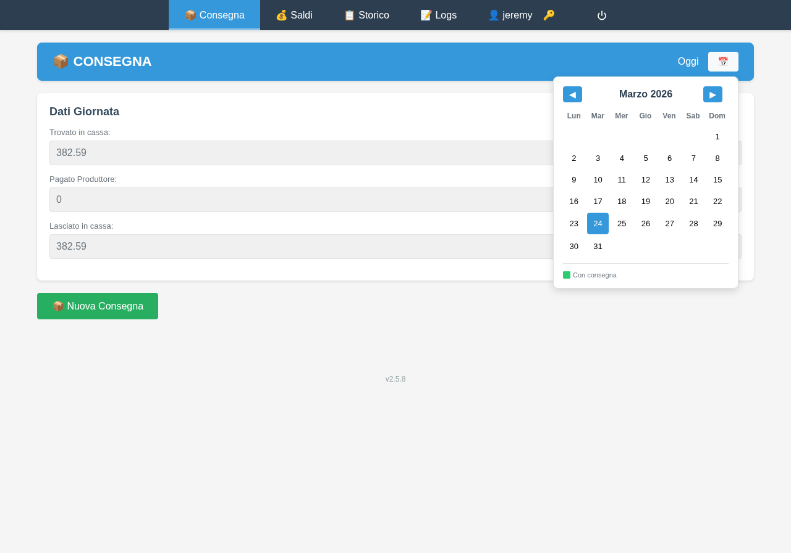
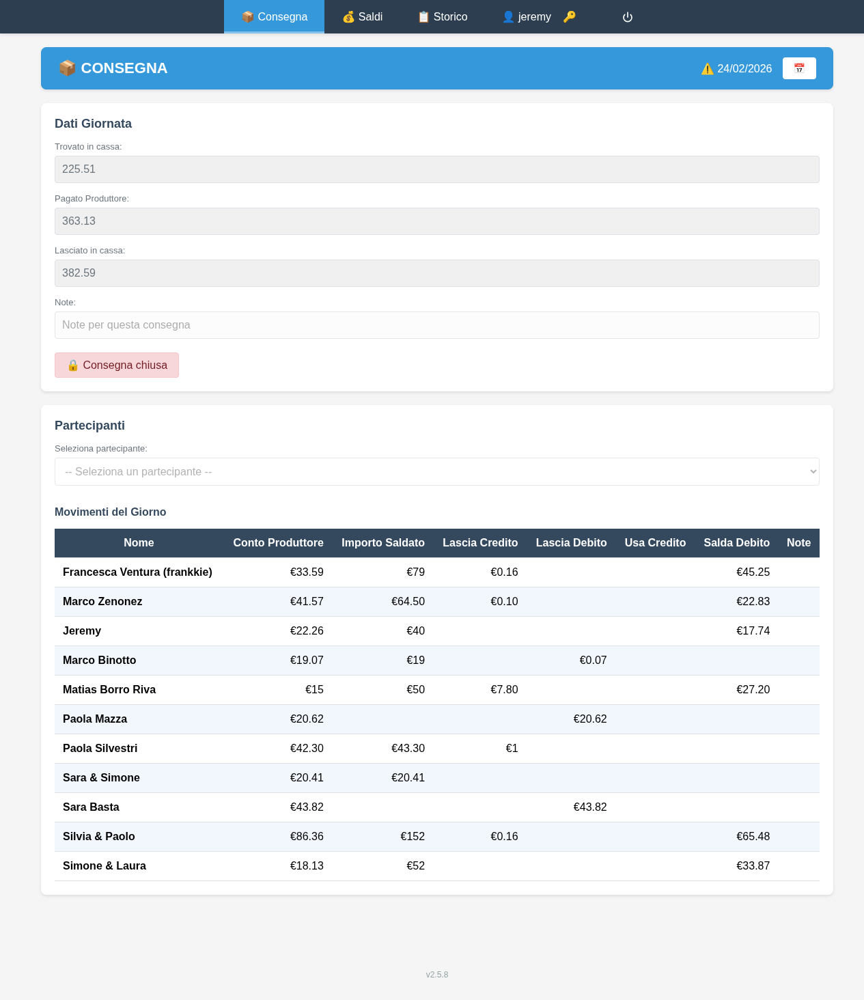
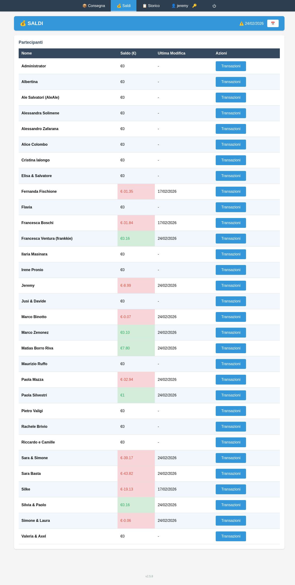
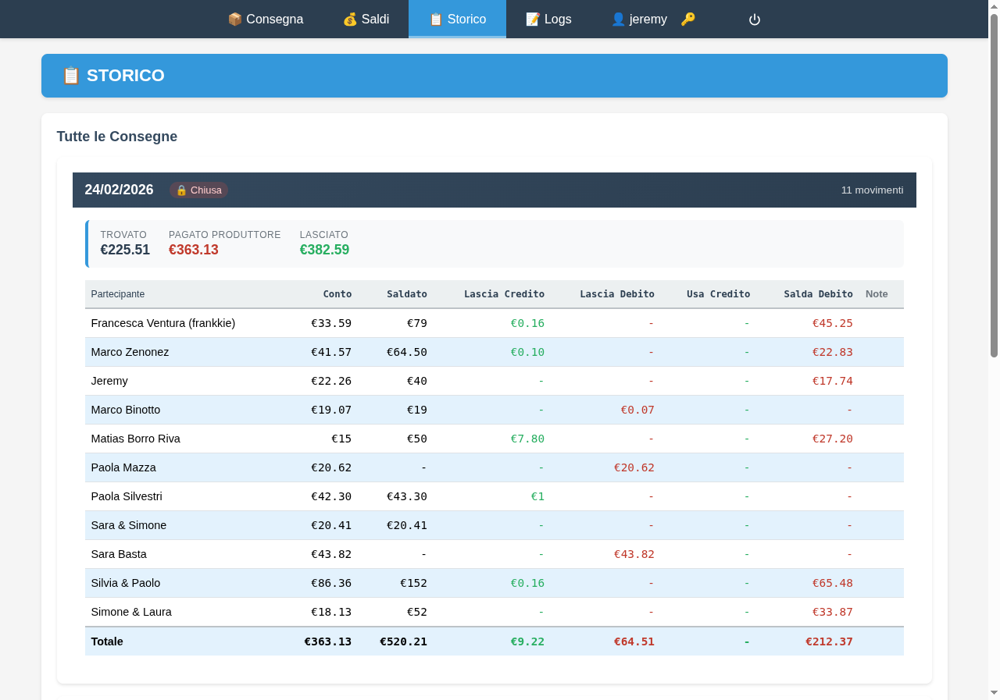

# Accesso

Apri il browser e vai su **https://gass.x86.it**. Inserisci le tue credenziali e clicca **Accedi**.

Per cambiare la tua password clicca il pulsante **🔑** in alto a destra.

{ width=50% }

**Navigazione:** menu in alto — *Consegna*, *Saldi*, *Storico* (e *Logs* per gli amministratori).

---

# Consegna

Pagina principale per registrare i movimenti giornalieri. Usa il pulsante **📅** per scegliere la data — le date con **punto verde** hanno già una consegna registrata.

{ width=60% }

Se per la data selezionata non esiste ancora una consegna, appare il pulsante **📦 Nuova Consegna** — cliccalo per iniziare.

## Dati Giornata (Cassa)

I tre campi sono **sola lettura** e calcolati automaticamente dal sistema:

- **Trovato in cassa** — il lasciato della consegna precedente
- **Pagato Produttore** — somma dei conti produttore di tutti i movimenti del giorno
- **Lasciato in cassa** — trovato + incassato - pagato

## Registrare un Movimento

1. Seleziona il **partecipante** dal menu a tendina
2. Inserisci il **Conto Produttore** (quanto deve al produttore)
3. Inserisci l'**Importo Saldato** (quanto porta oggi)
4. Il sistema calcola automaticamente eventuali **Lascia Credito** o **Lascia Debito**
5. Clicca **Salva Movimento**

> Se il partecipante ha un debito o credito pregressi, il sistema li compensa automaticamente — controlla il riepilogo prima di salvare.

{ width=100% }

## Chiudere la Consegna

Dopo aver inserito tutti i movimenti clicca **🔒 Chiudi Consegna** per bloccare la giornata. Solo un amministratore può riaprirla con **🔓 Riapri Consegna**.

---

# Saldi

Panoramica dei saldi di tutti i partecipanti. **Verde** = credito, **Rosso** = debito, **Grigio** = in pari.

Usa il **📅** per vedere i saldi in una data passata. Clicca **Transazioni** per vedere lo storico movimenti di un partecipante.

{ width=100% }

---

# Storico

Elenco di tutte le consegne in ordine cronologico inverso, con i dati di cassa e i movimenti per ogni giornata.

{ width=100% }

---

# Solo per Amministratori

| Funzione | Come accedervi |
|---|---|
| Riaprire consegna chiusa | Consegna → **🔓 Riapri Consegna** |
| Modificare un saldo | Saldi → **Modifica Saldo** (solo data odierna) |
| Aggiungere partecipanti | Saldi → **+ Aggiungi Partecipante** |
| Modificare utenti | Saldi → **Modifica Utente** |
| Log attività | Menu → **📝 Logs** |
