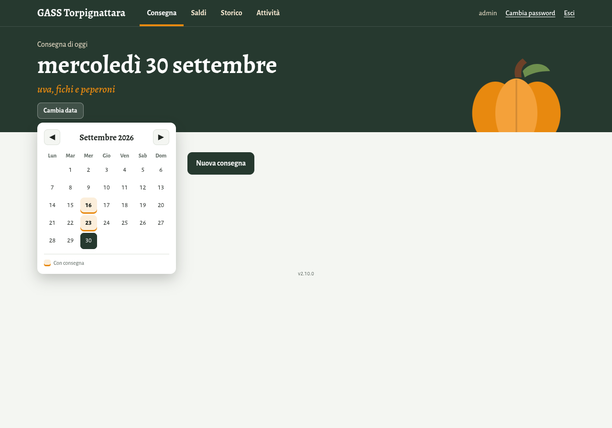
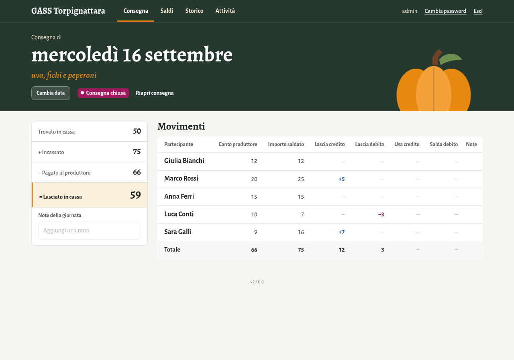
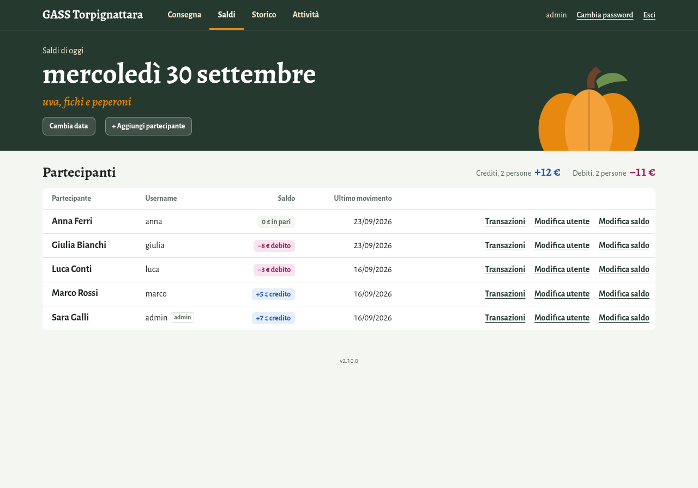
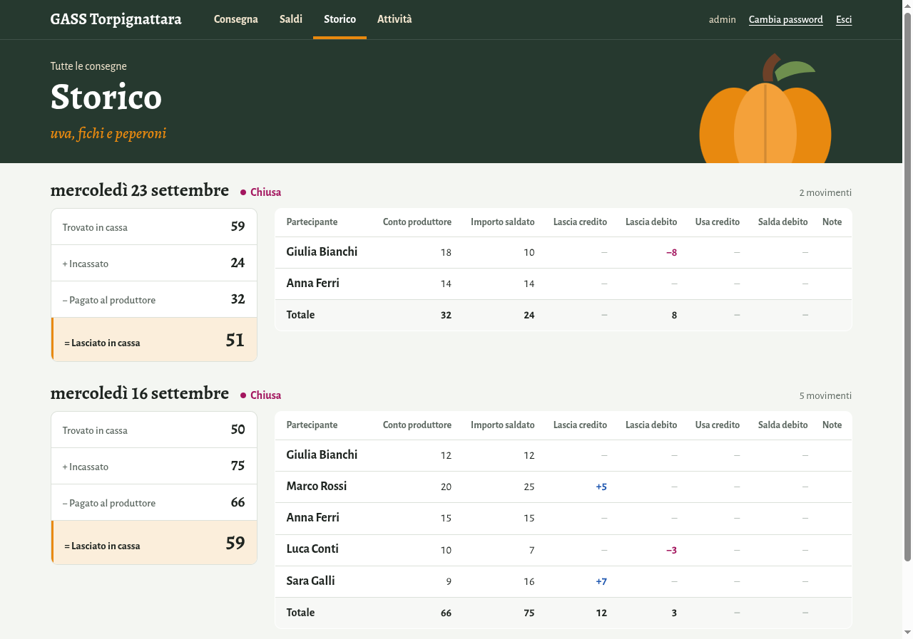

# Accesso

Apri il browser e vai su **https://gass.x86.it**. Clicca **Accedi** e inserisci nome utente e password. Al primo accesso usa la password provvisoria ricevuta: GASS ti chiede di sceglierne una nuova (almeno 8 caratteri).

Guida in una pagina: **https://gass.x86.it/inbreve**. Video del primo accesso e dei turni: **https://gass.x86.it/comefunziona**.

Per cambiare la password in seguito vai su **https://auth.x86.it**, nelle impostazioni del tuo utente.

{ width=50% }

**Navigazione:** menu in alto — *Consegna*, *Saldi*, *Storico* (e *Attività* per gli amministratori); a destra il tuo nome, *Cambia password* (solo account locali) ed *Esci*. L'intestazione scura cambia colore con la stagione della data scelta.

---

# Consegna

Pagina principale per registrare i movimenti giornalieri. Usa **Cambia data** per scegliere la data (**Oggi** torna a oggi) — le date con sfondo colorato e sottolineatura ("Con consegna") hanno già una consegna registrata.

{ width=60% }

Se per la data selezionata non esiste ancora una consegna, appare il pulsante **Nuova consegna** — cliccalo per iniziare.

## Dati Giornata (Cassa)

La colonna a sinistra mostra la cassa come una somma, calcolata automaticamente dal sistema (non si scrive nulla):

- **Trovato in cassa** — il lasciato della consegna precedente
- **+ Incassato** — somma degli importi saldati
- **− Pagato al produttore** — somma dei conti produttore di tutti i movimenti del giorno
- **= Lasciato in cassa** — trovato + incassato - pagato

Sotto, le **Note della giornata** (con **Salva note** quando cambiano). Lo stato (*Consegna aperta* / *chiusa*) e i pulsanti Chiudi / Riapri / Annulla consegna sono nell'intestazione, accanto a **Cambia data**.

## Registrare un Movimento

1. Nella sezione **Movimenti** seleziona il **partecipante** da **+ Aggiungi partecipante** (per modificare un movimento già inserito, clicca la sua riga nella tabella)
2. Sotto la tabella si apre il modulo: inserisci il **Conto produttore** (quanto deve al produttore)
3. Inserisci l'**Importo saldato** (quanto porta oggi)
4. Il sistema calcola automaticamente eventuali **Lascia credito** o **Lascia debito** e lo mostra nel riquadro finale
5. Clicca **Salva movimento**

La tabella ha le colonne Partecipante, Conto produttore, Importo saldato, Lascia credito, Lascia debito, Usa credito, Salda debito, Note e la riga **Totale**; gli zeri sono mostrati come "–".

> Se il partecipante ha un debito o credito pregressi, il sistema li compensa automaticamente — controlla il riepilogo prima di salvare.

{ width=100% }

## Chiudere la Consegna

Dopo aver inserito tutti i movimenti clicca **Chiudi consegna** e conferma il riepilogo per bloccare la giornata. Se la cassa è negativa compare l'avviso "Cassa negativa": controlla i movimenti prima di chiudere. Solo un amministratore può riaprirla: in **Storico** con **Riapri consegna**, oppure qui con **Cambia data** e poi **Riapri consegna** nell'intestazione.

---

# Saldi

Panoramica dei saldi di tutti i partecipanti. **Blu** con "+" e "credito" = credito, **rosso vino** con "−" e "debito" = debito, **grigio** "0 € in pari".

Usa **Cambia data** per vedere i saldi in una data passata. Clicca **Transazioni** per vedere lo storico movimenti di un partecipante.

{ width=100% }

---

# Storico

Elenco di tutte le consegne in ordine cronologico inverso: per ogni giornata la data, lo stato (Aperta/Chiusa), la cassa a sinistra e la tabella dei movimenti con il Totale a destra. Se una giornata è ancora aperta, **Completa consegna** la apre nella pagina Consegna.

{ width=100% }

---

# Turni

Le prossime 12 settimane con i due turnisti di ogni consegna (martedì). La tua riga è segnata **TU**; **da coprire** = manca un turnista; **riunione** = riunione GASS.

Per scambiare un tuo turno clicca il tuo nome e scegli **scambia con…**: la persona scelta prende il tuo turno e tu il suo primo turno da oggi. Conferma nella finestra che riepiloga lo scambio.

Gli amministratori possono scambiare qualsiasi nome e anche **sostituisci con…** / **assegna a…**. **Giorno** sposta la consegna, la segna **niente consegna** o **riunione GASS**, aggiunge una nota. In fondo, **Pause** per i periodi senza consegne.

---

# Solo per Amministratori

| Funzione | Come accedervi |
|---|---|
| Riaprire consegna chiusa | Storico → **Riapri consegna** (accanto alla data), oppure Consegna → **Cambia data** → **Riapri consegna** |
| Eliminare una consegna salvata | Consegna → **Annulla consegna** |
| Modificare un saldo | Saldi → **Modifica saldo** (solo data odierna) |
| Aggiungere partecipanti | Saldi → **+ Aggiungi partecipante** |
| Modificare utenti | Saldi → **Modifica utente** |
| Eliminare un utente | Saldi → **Modifica utente** → **Elimina utente** (solo se non ha movimenti né rettifiche di saldo) |
| Sospendere / disattivare / riattivare un utente | Saldi → **Modifica utente** → Stato (**Attivo**, **Sospeso**, **Disattivato**); per vedere i disattivati spuntare **Mostra disattivati** |
| Modificare i turni | Turni → clicca un nome, **Giorno**, **Pause** |
| Log attività | Menu → **Attività** |
