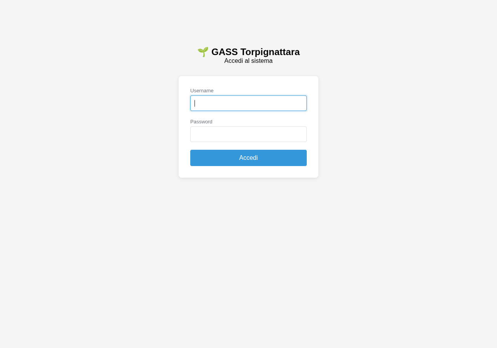
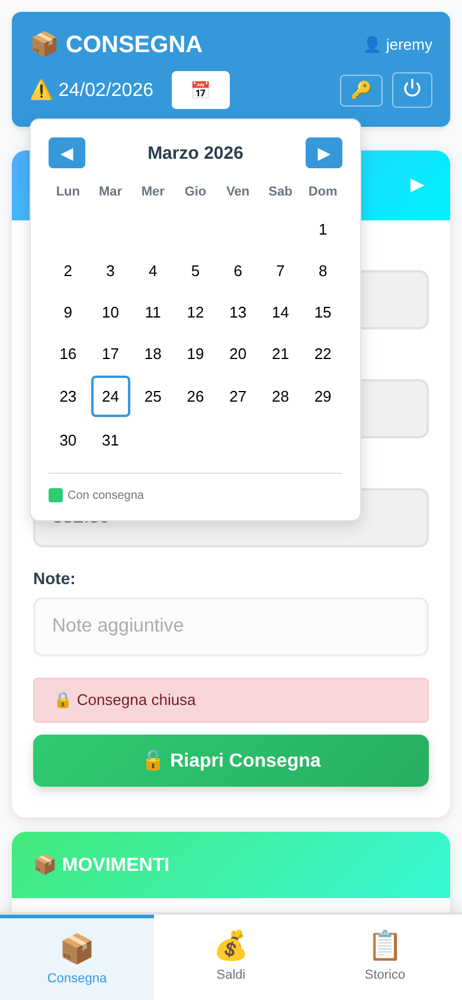
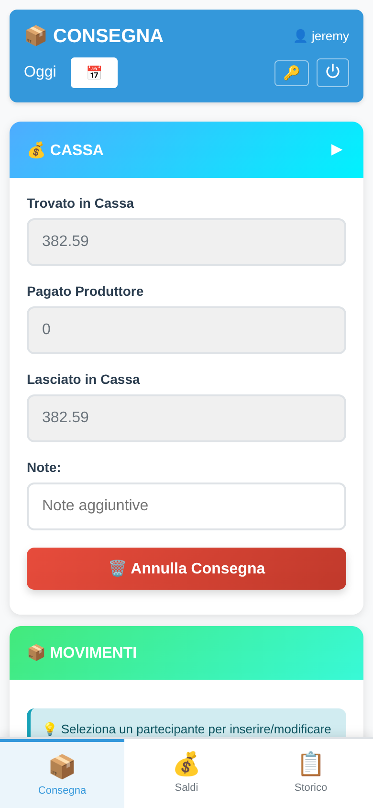
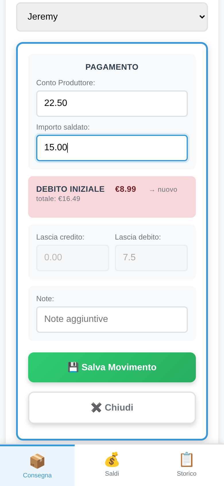
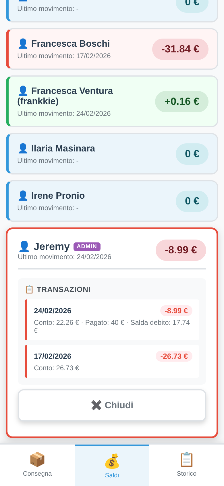
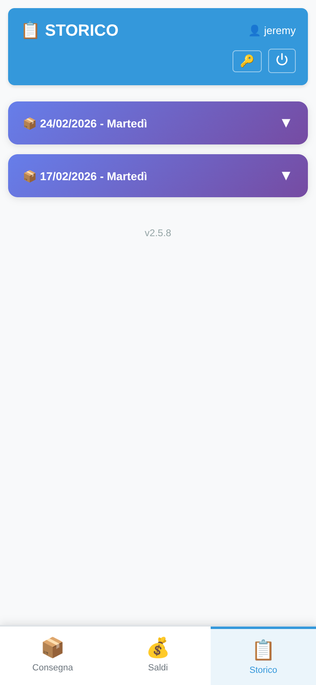

# Accesso

Apri il browser e vai all'indirizzo dell'applicazione. Inserisci le tue credenziali e clicca **Accedi**.

Per cambiare la tua password clicca il pulsante **🔑** in alto a destra.

{ width=50% }

**Navigazione:** barra in basso con tre schede — *Consegna*, *Saldi*, *Storico*.

---

# Consegna

Usa il pulsante **📅** per scegliere la data. Le date con **punto verde** hanno già una consegna registrata. Se non esiste ancora una consegna, appare il pulsante **📦 Nuova Consegna**.

{ width=45% }

La sezione **💰 CASSA** (espandibile) mostra i totali della giornata — tutti calcolati automaticamente, non si inserisce nulla.

{ width=45% }

## Registrare un Movimento

1. Nella sezione **📦 MOVIMENTI** seleziona il **partecipante** dal menu
2. Si apre il modulo — inserisci:
   - **Conto Produttore** (quanto deve al produttore)
   - **Importo Saldato** (quanto porta oggi)
3. Il sistema calcola automaticamente credito o debito residuo
4. Clicca **Salva**

> Se il partecipante ha debiti/crediti pregressi, vengono compensati automaticamente.

{ width=45% }

## Chiudere la Consegna

Nella sezione **💰 CASSA**, clicca **🔒 Chiudi Consegna** per bloccare la giornata. Solo un amministratore può riaprirla.

---

# Saldi

Lista di tutti i partecipanti con il saldo attuale. **+** verde = credito, **-** rosso = debito.

Usa il **📅** per vedere i saldi in una data passata.

**Tocca una card** per espanderla e vedere lo storico movimenti di quel partecipante.

{ width=45% }

---

# Storico

Elenco di tutte le consegne in ordine cronologico inverso. Tocca una consegna per espanderla e vedere cassa e movimenti della giornata.

{ width=45% }

---

# Solo per Amministratori

| Funzione | Come accedervi |
|---|---|
| Riaprire consegna chiusa | Consegna → **🔓 Riapri Consegna** |
| Modificare un saldo | Saldi → espandi card → **Modifica Saldo** (solo oggi) |
