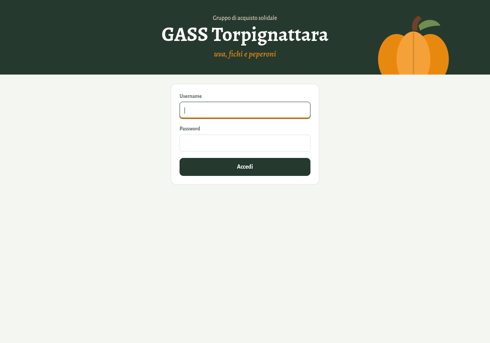
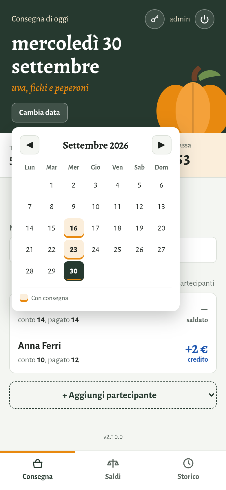
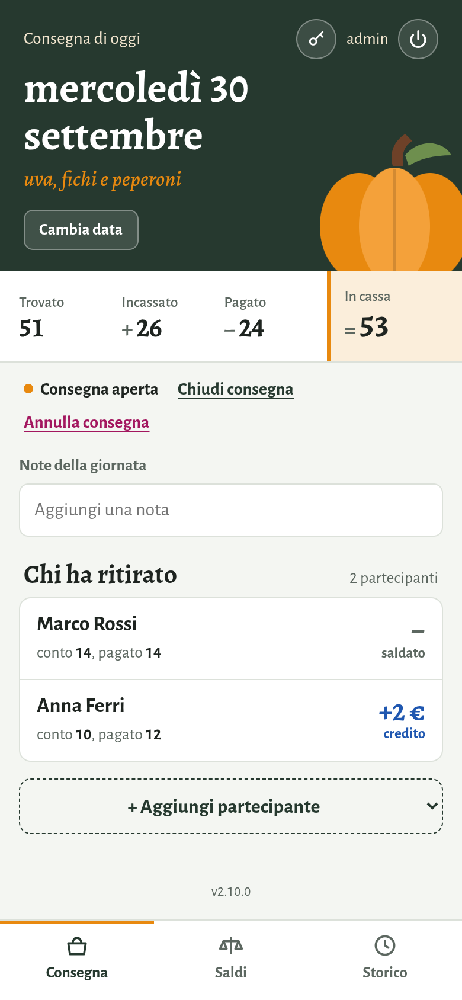
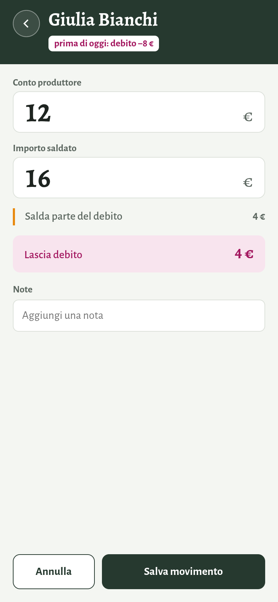
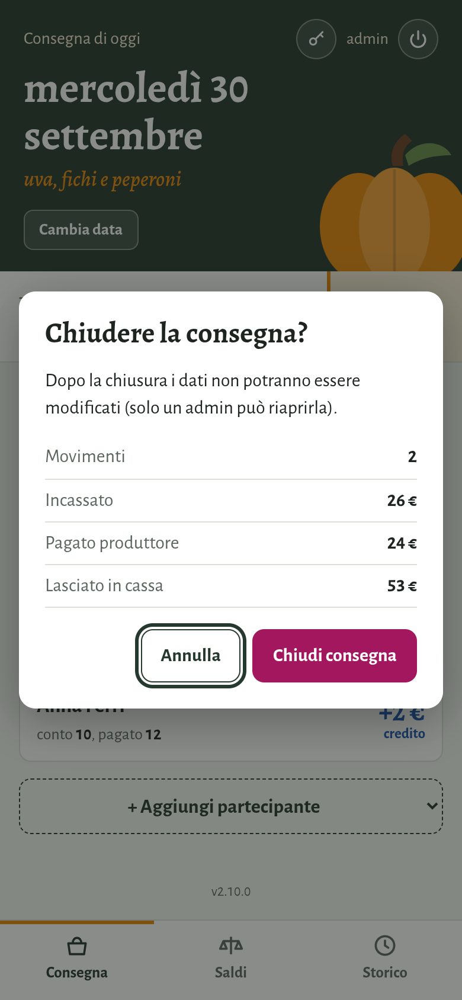
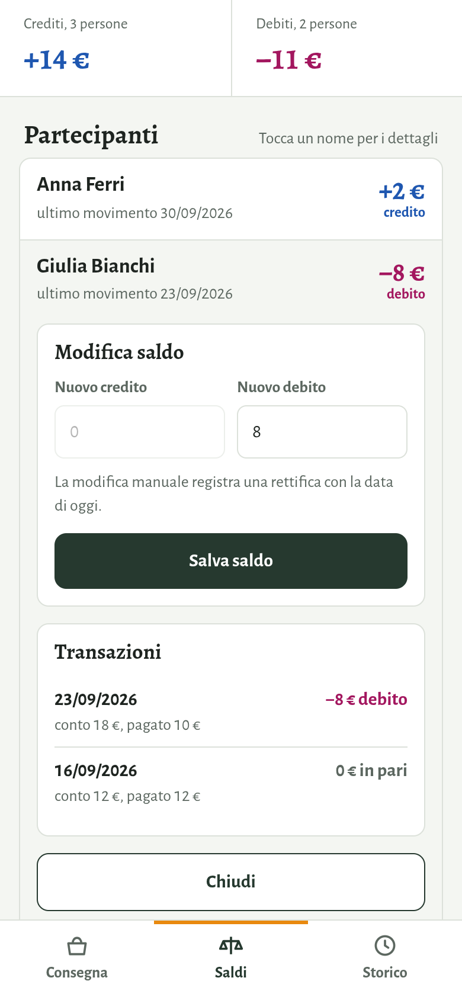
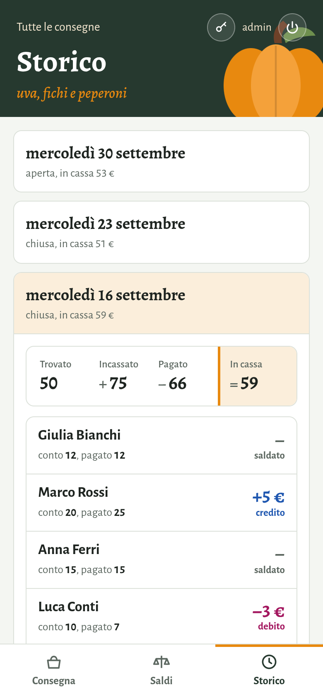

# Accesso

Apri il browser e vai su **https://gass.x86.it**. Clicca **Accedi** e inserisci nome utente e password. Al primo accesso usa la password provvisoria ricevuta: GASS ti chiede di sceglierne una nuova (almeno 8 caratteri).

Guida in una pagina: **https://gass.x86.it/inbreve**. Video del primo accesso: **https://gass.x86.it/comefunziona**.

Per cambiare la password in seguito vai su **https://auth.x86.it**, nelle impostazioni del tuo utente.

{ width=50% }

**Navigazione:** barra in basso con tre schede — *Consegna*, *Saldi*, *Storico*. In alto compaiono il tuo nome, la chiave (cambia password, solo account locali) e l'icona di uscita (*Esci*). L'intestazione scura cambia colore con la stagione della data scelta.

---

# Consegna

Usa **Cambia data** per scegliere la data (**Oggi** torna a oggi). Le date con sfondo colorato e sottolineatura ("Con consegna") hanno già una consegna registrata. Se non esiste ancora una consegna, appare il pulsante **Nuova consegna**.

{ width=45% }

In cima la riga della cassa mostra i totali della giornata come una somma: Trovato, + Incassato, − Pagato, = In cassa — tutti calcolati automaticamente, non si inserisce nulla. Sotto, lo stato (*Consegna aperta* / *Consegna chiusa*) e le *Note della giornata*.

{ width=45% }

## Registrare un Movimento

1. Nella sezione **Chi ha ritirato** seleziona il **partecipante** da **+ Aggiungi partecipante** (per modificare un movimento già inserito, tocca la sua riga)
2. Si apre il modulo a tutto schermo — inserisci:
   - **Conto produttore** (quanto deve al produttore)
   - **Importo saldato** (quanto porta oggi)
3. Il sistema calcola automaticamente credito o debito residuo e lo mostra nel riquadro finale (*Lascia credito*, *Lascia debito* o *Esito: saldato*). Nell'elenco *Chi ha ritirato* ogni riga mostra cosa lascia quel movimento: credito, debito o *saldato*
4. Clicca **Salva movimento**

> Se il partecipante ha debiti/crediti pregressi, vengono compensati automaticamente.

{ width=45% }

## Chiudere la Consegna

Dopo aver salvato almeno un movimento, sotto la riga della cassa compare il link **Chiudi consegna** — cliccalo e conferma il riepilogo per bloccare la giornata. Solo un amministratore può riaprirla: in **Storico** con **Riapri consegna**, oppure qui con **Cambia data** e poi **Riapri consegna**. Se la cassa è negativa compare l'avviso "Cassa negativa": controlla i movimenti prima di chiudere.

{ width=45% }

---

# Saldi

In cima i totali dei crediti e dei debiti, poi la lista **Partecipanti** con il saldo attuale. **+** blu con "credito" = credito, **−** rosso vino con "debito" = debito, grigio "in pari".

Usa **Cambia data** per vedere i saldi in una data passata.

**Tocca un nome** per vedere il dettaglio e lo storico movimenti di quel partecipante.

{ width=45% }

---

# Storico

Elenco di tutte le consegne in ordine cronologico inverso, con data, stato (aperta/chiusa) e cassa. Tocca una consegna per espanderla e vedere cassa e movimenti della giornata; se è ancora aperta, **Completa consegna** la apre nella pagina Consegna.

{ width=45% }

---

# Turni

Le prossime 12 settimane con i due turnisti di ogni consegna (martedì). La tua riga è segnata **TU**; **da coprire** = manca un turnista; **riunione** = riunione GASS. Solo gli amministratori modificano i turni, da desktop.

---

# Solo per Amministratori

| Funzione | Come accedervi |
|---|---|
| Riaprire consegna chiusa | Storico → **Riapri consegna** (sotto la giornata espansa), oppure Consegna → **Cambia data** → **Riapri consegna** |
| Eliminare una consegna salvata | Consegna → **Annulla consegna** |
| Modificare un saldo | Saldi → tocca il nome → **Modifica saldo** (solo oggi) |
